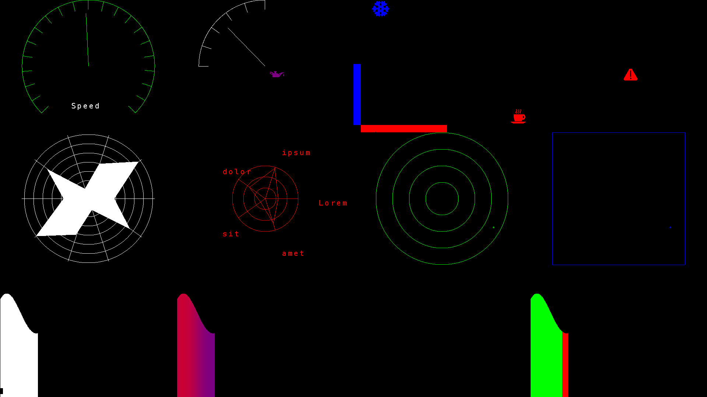
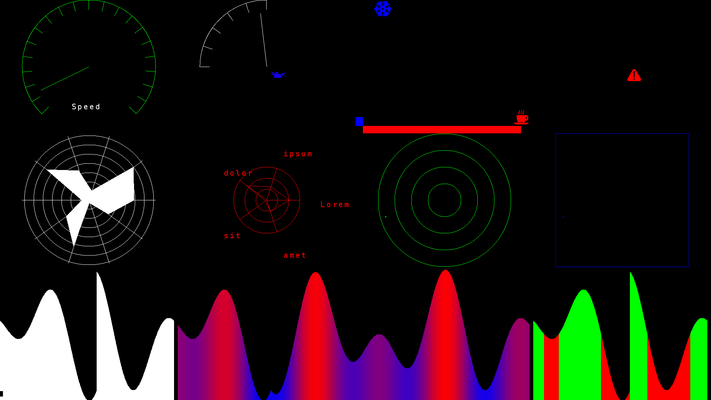

Car dashboard graphic library
=============================

Introduction
------------

This C library implements drawing functions for common car dashboard controls.
It was commissioned by a friend who is working on an embedded project, so it's as fast and as decoupled from the hardware as possible (the library itself invokes architecture specific functions defined in `screen.h` and `utils.h`, the implementations of which can be modified without altering the controls' code).

A demo running on Linux framebuffer is provided.

 

It was developed with an 80MHz `ST32 Nucleo-64` on mind, so it probably won't run fast enough on an `Arduino`, but it certainly will on a `Raspberry Pi` (and since it uses the framebuffer, none of the functions needs to be changed).

Compilation
-----------

Simply run `make`.

Execution
---------

From a real terminal (e.g. after hitting `CTRL + ALT + F2`) run `./Dashboard`.

Implemented controls
--------------------

Each control is composed of a `struct` which keeps track of the internal state of the control and of three functions:

- `init_<controlname>(...)` Instantiates the control and draws it
- `update_<controlname>(..., uint8_t ...)` Displays a value (or more) from `0` (min) to `255` (max) inside the control
- `delete_<controlname>(...)` Deallocates the control and clears the region of the screen it was placed in.

Each control structure has two colors (which can be changed at any moment):

- `fg` The color with which the control will be painted
- `bg` The background color with which the control's old value will be cleared.

### `Accelerometer`

- Displays two values orthogonally by moving a cross
- A circular or square outline can be chosen, with any number of concentric rings.

### `Bar`

- Displays a single value in a bar growing either horizontally or vertically.

### `Dial`

- Displays a single value in a dial either with a clockwise (`0` is on the left, `255` is on the right) or a counterclockwise rotation
- Arc length and phase of the dial can be chosen, as well as an arbitrary number of ticks dividing the quadrant.

### `Plot`

- Displays a plot of a single value over time (measured as number of times `update_plot(...)` was called)
- The x axis of the plot moves forward by one pixel, modulo the control's width
- The y axis of the plot is scaled with the control's height (`0 -> 0` and `255 -> height`).

### `Radar`

- Displays a radar plot of an arbitrary number of values
- The radar can be divided into an arbitrary number of concentric circles and the values can be displayed either with a filled or an empty polygon.

Important note: the polygon filling function is very slow, so this control might be unsuitable for embedded devices.

### `Symbols` &amp; text
- A dashboard symbol can be displayed or deleted
- Single ASCII-7 characters or null-terminated strings can be written on screen
- Strings are broken into multiple lines when a `\\n` is encountered.